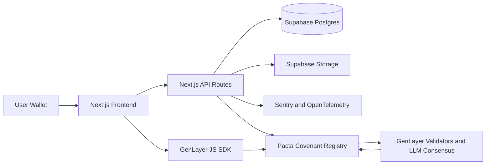

# Architecture

## Overview

Pacta is a production-oriented monorepo with a Next.js frontend, Next.js API route handlers, Supabase Postgres, Supabase Storage evidence records, and one GenLayer Intelligent Contract deployed to StudioNet.

## GenLayer Design

The single contract, `PactaCovenantRegistry`, handles covenant registration, payable GEN bond intake, evidence reference recording, AI-assisted evaluation, canonical outcome storage, bond claim accounting, protocol slash accounting, reputation score deltas, and an event log for backend synchronization.

External web reads and LLM calls happen only inside nondeterministic blocks. Deterministic storage writes happen only after consensus returns.

## Request Flow

1. Client requests a wallet nonce.
2. User signs the nonce.
3. The Next.js API verifies the signature and starts a session.
4. User creates a covenant record through the API and contract.
5. User bonds GEN through the GenLayer contract.
6. Evidence is uploaded to Supabase Storage and evidence references are registered on-chain.
7. Evaluation is requested through the Intelligent Contract.
8. GenLayer validators evaluate covenant terms, evidence references, and public web context.
9. Contract stores the canonical outcome and bond claim accounting.
10. API routes expose contract state reads and Supabase-backed read models.
